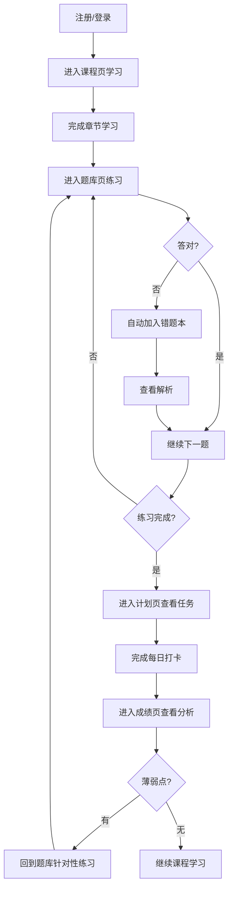
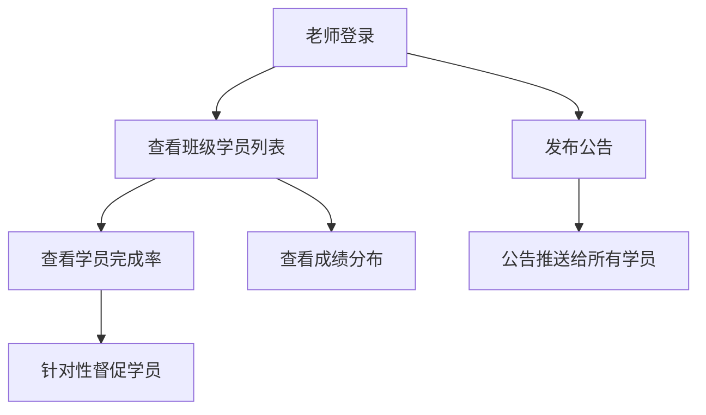

## 1. 产品概述

「备考通」是一个面向职业考试备考学员和小型培训班的 Web 学习备考平台。平台帮助学员系统化地学习课程内容、刷题练习、管理错题、制定学习计划并追踪成绩变化；同时为培训班老师提供公告发布和学员进度监控功能，实现"学-练-测-管"一体化闭环。

- **目标用户**：准备职业资格考试的学员（如会计、建造师、教师资格证等）以及管理班级的小型培训机构老师
- **核心价值**：将分散的学习工具整合为统一平台，降低学员的学习管理成本，提升培训班的运营效率

## 2. 核心功能

### 2.1 用户角色

| 角色 | 注册方式 | 核心权限 |
|------|----------|----------|
| 学员 | 邮箱/手机注册 | 浏览课程、刷题练习、管理错题、制定计划、查看成绩、收藏题目 |
| 老师 | 邮箱/手机注册 + 角色选择 | 上述所有权限 + 发布公告、查看班级学员完成情况、管理题库 |

### 2.2 功能模块

1. **课程页**：按章节播放学习资料，记录学习进度，支持资料类型切换
2. **题库页**：章节练习、随机组卷、限时模拟考试、收藏题目
3. **错题页**：按知识点归类错题、重做错题、添加解析笔记
4. **计划页**：生成每日学习任务、打卡提醒、调整复习频率
5. **成绩页**：正确率统计、薄弱知识点分析、模考排名、老师公告发布与学员完成情况查看

### 2.3 页面详情

| 页面名称 | 模块名称 | 功能描述 |
|----------|----------|----------|
| 课程页 | 章节导航 | 左侧树形章节列表，显示章节标题与进度百分比 |
| 课程页 | 资料播放区 | 中央区域展示学习资料（视频/PDF/图文），支持上下翻页和进度标记 |
| 课程页 | 进度追踪 | 顶部全局进度条，自动记录已学章节，完成标记打勾 |
| 题库页 | 章节练习 | 按章节筛选题目，逐题作答，即时反馈对错与解析 |
| 题库页 | 随机组卷 | 自定义题目数量和知识点范围，一键生成练习卷 |
| 题库页 | 限时模拟 | 全真模拟考试环境，倒计时、自动交卷、评分 |
| 题库页 | 题目收藏 | 练习中一键收藏，收藏夹统一管理 |
| 错题页 | 错题归类 | 按知识点自动归类所有错题，支持筛选和搜索 |
| 错题页 | 错题重做 | 逐题重新作答，答对自动移出错题本 |
| 错题页 | 解析笔记 | 为每道错题添加个人笔记和解题思路 |
| 计划页 | 任务生成 | 根据目标和考试日期自动计算每日学习量 |
| 计划页 | 每日打卡 | 显示今日任务清单，完成一项勾选一项，支持打卡记录 |
| 计划页 | 复习提醒 | 基于艾宾浩斯遗忘曲线自动安排复习任务 |
| 成绩页 | 成绩概览 | 总正确率、各科正确率、学习时长统计的图表展示 |
| 成绩页 | 薄弱分析 | 按知识点展示正确率，高亮薄弱环节 |
| 成绩页 | 模考排名 | 历次模拟考试成绩趋势图和班级排名 |
| 成绩页 | 老师面板 | 老师可发布公告、查看班级学员完成率和成绩分布 |

## 3. 核心流程

### 学员主流程

### 老师管理流程

## 4. 用户界面设计

### 4.1 设计风格

- **主题方向**：现代学术风格，融合温暖与专业感——采用柔和米白底色搭配深蓝学术色调，营造专注而不压抑的学习氛围
- **主色**：深靛蓝 `#1e3a5f`（导航、标题、重要按钮）
- **辅色**：暖金 `#c9a96e`（高亮、进度标记、打卡成功），柔和珊瑚 `#e07b5a`（错误提示、薄弱点标记）
- **中性色**：纸张白 `#faf8f5`（背景）、卡片白 `#ffffff`、墨灰 `#3d4f5f`（正文）
- **按钮风格**：微圆角（8px）、柔和阴影，主按钮填充深蓝，次按钮描边+悬停填充
- **字体**：标题使用思源宋体/Noto Serif SC，正文使用思源黑体/Noto Sans SC，数字/数据使用等宽字体 JetBrains Mono
- **布局风格**：左侧固定导航栏（240px），右侧内容区自适应，卡片式模块布局
- **图标风格**：线性图标，统一 24px 网格，使用 Lucide Icons 风格

### 4.2 页面设计概览

| 页面名称 | 模块名称 | UI 元素 |
|----------|----------|---------|
| 课程页 | 章节导航 | 左侧 280px 侧栏，树形展开，进度条+百分比+勾选标记，当前章节高亮 |
| 课程页 | 资料播放区 | 中央最大区域，卡片式内容容器，顶部类型切换标签（视频/文档），底部翻页按钮，右侧进度标记按钮 |
| 课程页 | 进度追踪 | 顶部横幅进度条，显示"第 3/12 章 · 已完成 25%"，渐变色填充 |
| 题库页 | 章节练习 | 顶部筛选栏（下拉选择章节），中央题目卡片，选项列表（A/B/C/D），提交后即时变色（绿对/红错），底部解析展开区 |
| 题库页 | 随机组卷 | 弹出面板，滑块调节题数，多选知识点，生成按钮带加载动画 |
| 题库页 | 限时模拟 | 顶部倒计时（红色紧迫感），题目区同上，底部题号导航矩阵，自动交卷弹窗 |
| 题库页 | 题目收藏 | 每道题右上角星形收藏按钮，收藏夹页面网格展示 |
| 错题页 | 错题归类 | 左侧知识点标签云/列表，右侧错题卡片列表，每张卡片显示题目摘要、错误次数、添加时间 |
| 错题页 | 错题重做 | 选中错题进入答题模式，界面同题库练习，答对后弹出"已掌握"动画并移除 |
| 错题页 | 解析笔记 | 每道错题下方展开笔记编辑区，支持纯文本输入，自动保存 |
| 计划页 | 任务生成 | 顶部目标设置栏（考试日期选择器、目标分数），下方日历视图展示每日任务 |
| 计划页 | 每日打卡 | 今日任务卡片列表，每项左侧勾选框，完成勾选后文字划线+绿色标记，底部今日打卡按钮 |
| 计划页 | 复习提醒 | 右侧面板显示待复习项目，按遗忘曲线标注紧急程度（红/橙/绿） |
| 成绩页 | 成绩概览 | 顶部统计卡片行（总正确率、总题数、学习天数），中部雷达图/柱状图展示各科正确率 |
| 成绩页 | 薄弱分析 | 知识点列表，按正确率升序排列，低正确率项红色高亮，点击可跳转练习 |
| 成绩页 | 模考排名 | 折线图展示成绩趋势，表格展示历次模考分数与排名 |
| 成绩页 | 老师面板 | 公告编辑器（标题+内容+发布按钮），学员完成率表格（头像+姓名+进度条+正确率） |

### 4.3 响应式设计

- **桌面端优先**（≥1280px）：左侧导航固定，内容区最大宽度 1200px 居中
- **平板端**（768px-1279px）：左侧导航折叠为汉堡菜单，内容区全宽
- **移动端**（<768px）：底部标签导航，卡片纵向堆叠，图表简化

---

## 5. 非功能需求

- **数据持久化**：使用本地存储（localStorage）模拟后端，刷新不丢失数据
- **性能**：首屏加载 < 2s，页面切换 < 300ms
- **可访问性**：键盘导航支持、语义化 HTML、适当的色彩对比度
- **预设数据**：内置示例课程、题库数据，方便演示和体验