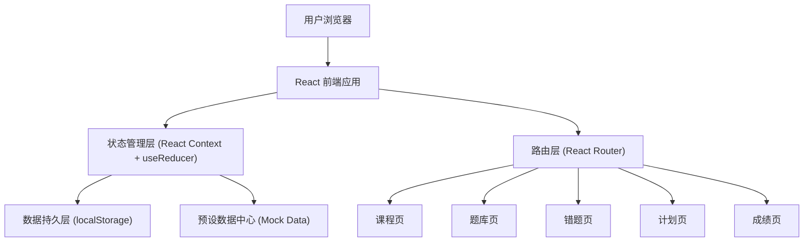
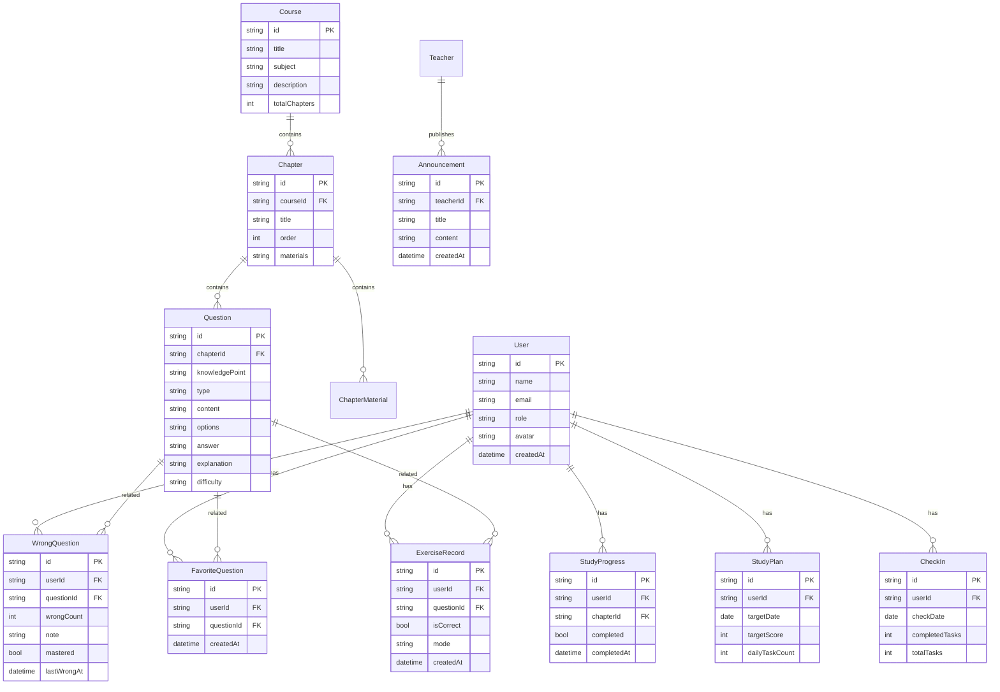

## 1. 架构设计

本项目采用纯前端架构，无后端服务。所有数据通过 React Context 进行状态管理，利用 localStorage 实现数据持久化。预设的模拟数据（课程内容、题库、学员信息等）在首次加载时写入 localStorage。

## 2. 技术描述

- **前端框架**：React 18 + TypeScript
- **样式方案**：Tailwind CSS 3 + CSS 变量（自定义主题）
- **构建工具**：Vite 5
- **路由管理**：React Router v6
- **状态管理**：React Context + useReducer
- **图表可视化**：Recharts
- **图标库**：Lucide React
- **数据存储**：localStorage（模拟数据库）
- **包管理器**：npm

## 3. 路由定义

| 路由 | 页面名称 | 说明 |
|------|----------|------|
| `/` | 登录/注册页 | 用户认证入口，角色选择 |
| `/courses` | 课程页 | 章节学习与进度追踪 |
| `/courses/:chapterId` | 课程详情 | 具体章节资料播放 |
| `/exercises` | 题库页 | 章节练习、随机组卷、限时模拟 |
| `/exercises/:mode` | 练习模式 | mode: chapter/random/timed |
| `/wrong-questions` | 错题页 | 错题归类、重做、笔记 |
| `/study-plan` | 计划页 | 学习计划与打卡 |
| `/scores` | 成绩页 | 成绩分析与排名 |
| `/scores/announcements` | 公告管理 | 老师发布公告 |

## 4. 数据模型

### 4.1 实体关系图

### 4.2 数据定义

所有数据以 JSON 格式存储在 localStorage 中，键名规范如下：

| localStorage Key | 对应实体 | 说明 |
|------------------|----------|------|
| `exam_app_users` | User[] | 用户列表 |
| `exam_app_courses` | Course[] | 课程列表 |
| `exam_app_chapters` | Chapter[] | 章节列表 |
| `exam_app_questions` | Question[] | 题库 |
| `exam_app_wrong_questions` | WrongQuestion[] | 错题记录 |
| `exam_app_study_progress` | StudyProgress[] | 学习进度 |
| `exam_app_exercise_records` | ExerciseRecord[] | 练习记录 |
| `exam_app_study_plans` | StudyPlan[] | 学习计划 |
| `exam_app_checkins` | CheckIn[] | 打卡记录 |
| `exam_app_favorites` | FavoriteQuestion[] | 收藏题目 |
| `exam_app_announcements` | Announcement[] | 公告 |
| `exam_app_current_user` | User | 当前登录用户 |

### 4.3 预设数据策略

- 首次加载时检测 localStorage 是否为空，若为空则自动写入预设模拟数据
- 预设数据包含：3 门课程（每门 6-8 章）、每章 10-20 道题目、3 条示例公告
- 预设用户：1 名学员 + 1 名老师，方便演示角色切换